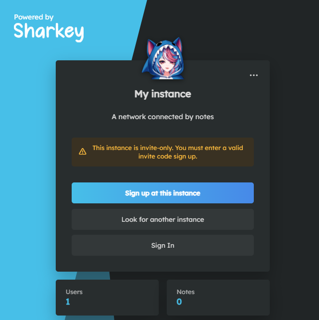

# Sharkey CI/CD pipeline

Deploy Sharkey server with CI/CD on Elestio

 
 

# Once deployed ...

You can open Sharkey here:

    URL: https://[CI_CD_DOMAIN]
    login: "admin"
    password: "[ADMIN_PASSWORD]"

You can open pgAdmin here:

    URL: "https://[CI_CD_DOMAIN]:62379"
    login: "[ADMIN_EMAIL]"
    password: "[ADMIN_PASSWORD]"

# Custom domain instructions (IMPORTANT)

By default we setup a CNAME on elestio.app domain, but probably you will want to have your own domain.

**_Step1:_** add your domain in Elestio dashboard as explained here:

    https://docs.elest.io/books/security/page/custom-domain-and-automated-encryption-ssltls

**_Step2:_** update the env vars and default.yml to indicate your custom domain
Open Elestio dashboard > Service overview > click on UPDATE CONFIG button > Env tab
there update `DOMAIN` with your real domain

**_Step3:_** you must reset the Sharkey instance, you can do that with those commands, connect over SSH and run this:

    cd /opt/app;
    docker-compose down;
    rm -rf ./storage;
    ./scripts/preInstall.sh
    docker-compose up -d
    ./scripts/postInstall.sh

You will start over with a fresh instance of Sharkey directly configured with the correct custom domain name and federation will work as expected
